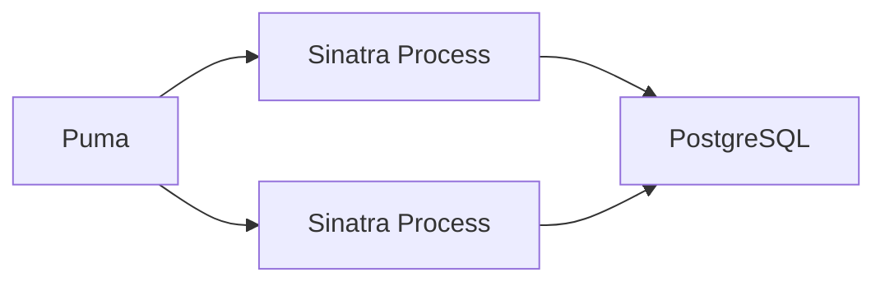

### ruby-app-boilerplate
---

#### What is it?
This is starting point to create a fast web app using Sinatra. I didn't had the experience to create apps with ruby, so I tried to create this one to improve myself.

#### What technologies are you using?
- Ruby 2.6.3
- Sinatra;
    - Puma;
    - ActiveRecord;
    - Rake;
    - Rubocop;
    - Rspec;
- PostgreSQL;
- Docker;
- CircleCI;

#### Architecture:

#### How I get started?
1. Clone it
2. Remove .git folder `rm -rf .git`
3. Start the repository `git init`
4. Add origin remote: `git remote add https://new_repository.git`
5. `git add .` and then `git push origin master`

#### To start application:
> docker-compose run web rake db:setup db:migrate
> docker-compose up

#### To run tests:
> docker-compose run -e APP_ENV=test web rake db:setup db:migrate
> docker-compose run -e APP_ENV=test web rspec

---
